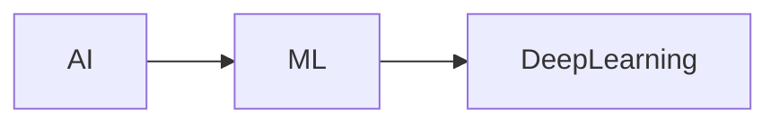
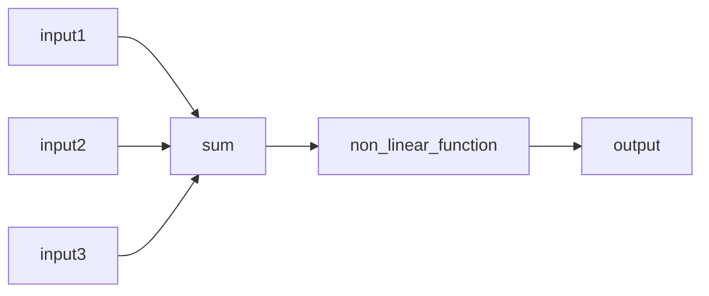

Deep learning is a subset of ML which is a subset of AI.
**learn TensorFlow and pytorch**
# The perceptron
![[Pasted image 20250505123847.png]]

	How to do neural networks
		1) You take the dot product
		2) add the bias
		3) apply the non linearity

after adding the weights we add a bias for shifting

![[Pasted image 20250505124027.png]]




example of non linear function : sigmoid function (converts to between -1 and 1), ReLU, tanh


	we want non linear function because data in real world is strictly non-linear
	A single perceptron draws a line in the 2D plane and separates it into two parts

## Building a neural network with perceptrons
```python
import torch
import torch.nn as nn
import torch.nn.init as init

class MyDenseLayer(nn.Module):
    def __init__(self, input_dim, output_dim):
        super(MyDenseLayer, self).__init__()
        # Initialize weights and bias as learnable parameters
        self.W = nn.Parameter(torch.empty(input_dim, output_dim))
        self.b = nn.Parameter(torch.empty(1, output_dim))
        
        # Initialize weights using Xavier/Glorot initialization
        # (appropriate for sigmoid activation)
        init.xavier_uniform_(self.W)
        init.zeros_(self.b)
    
    def forward(self, inputs):
        # Matrix multiplication + bias
        z = torch.matmul(inputs, self.W) + self.b
        # Apply sigmoid activation
        output = torch.sigmoid(z)
        return output

"""Instead you can use"""
model = nn.Sequential(
	nn.Linear(m, n1)
	nn.ReLU(),
	...
	nn.ReLU(),
	nn.Linear(nK,2)
)
```
	 - Now we add hidden layers
	 
![[Pasted image 20250505170001.png]]

	- So we need two weight matrixes. 


### Quantifying Loss

![[Pasted image 20250505175618.png]]

	- Closer prediction == lower loss

```python
#pytorch
#for yes/no situations
loss = torch.nn.fucntional.cross_entropy(predicted, y)
```
	- Another tool is mean square error
	
![[Pasted image 20250505175819.png]]
	
### Training Neural Networks

	- Aim is to find models that minimize the loss on a dataset

![[Pasted image 20250505175931.png]]

### Gradient Descent for loss reduction
	1) generate random weights
	2) loop until convergence
		1) compute gradient 
		2) update weights
	3) return weights
	
![[Pasted image 20250505181858.png]]

### Backpropagation
	- backbone of gradient descent
	- we want to find how a small change in weight change the output
	- chain rule is used to do this
Chain Rule for a simple NN with a single hidden layer
![[Pasted image 20250505190109.png]]

