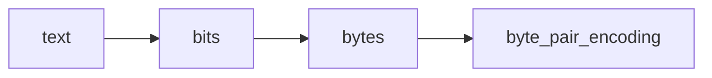
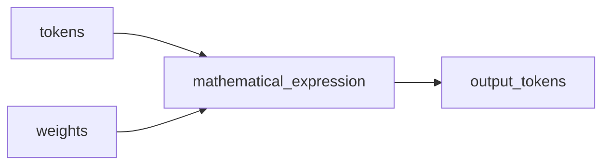

# Pretraining
	- Dowload and process the internet
	- get a lot of text from the internet, very high quality documents, very high diversity, most companies have their own datasets. Hugging face's fineweb is good, which is around 44TB : not very large beacuse we are dealing with text.
	- Step in filtering data
		1) URL filtering (adult site, racist sites, mining site etc)
		2) Text extraction (extracting data from HTML)
		3) Language Filtering (only take English websites, fastText language classifier)
		4) ...Other filter to remove duplicates and other things ...
		5) PII remover (personal identifier information remover)

# Tokenization
	- GPT expects a sequence of finite symbols (words followed by more words)
	- Its better to have large set of finite symbols rather than have a short one which produces lengthier sentences. Longer sentences limit context window significantly. So we would like to create information dense symbol set.
	- we use byte pair encoding (group together bytes or words that occur together very frequently); for example {116 32} occur together very frequently.
	- GPT 4 uses 100k symbols
	- In tokenization we do exactly this.

# Neural Network Training
	- take a 'window' of tokens from existing data. This can vary from 0 to a max size.
	- around 8000 tokens
	- Now we try to predict the token that comes next after theses tokens.
	- These 8000 tokens are fed into the neural network.
	- There are around 100k symbols. So the output would be probabilites of these symbols. We pick the one with the highest probability.
	- We compare the output with the correct one (keep in mind we know the correct answer)
	- Now we want the neural network to adjust and update so that the correct answer has a higher probability
	- This is done millions of time parallely with GPUs
## Neural Network Internals

# Inference
	 - generating new information from the model
	 - start with some random token (like 134)
	 - take the output probability vector and sample a token based on the probabilities
	 - and add it to the string of tokens
	 - sometimes the selected one will create a completely new string of tokens

The model you get after many many iterations of the transformer is the base model. This can only predict the next token given an input string. This is not the same as an AI assistant. The instruct model which is fine tuned is used in AI assistants.


# How to fix this ? (Base model only being able to predict the next token)
	1) Few shot prompting
		- Give a few examples before asking the next question. 
			- eg: apple: red, orange: orange, mango: yellow, pinapple: ....
		- the base model fill try to pick up the pattern and fill in the gap
	2) Use few shot prompting to give the start of a conversation between the assistant and a human. The model will try to predict the next tokens in the given format.

	The base model in a nutshell is an internet document simulator. We need to fine tune this to become an assistant.

# Post training
	- computationally not very expensive
	- develop a dataset of conversations of how the model should reply to humans
	- now use this dataset to fine tune the model
	- we use the same algorithms and methods as we used for training, except the dataset is swapped out.
```C
<|im_start|>system<|im_sep|>You are a helpful assistant<|im_end|>
<|im_start|>user<|im_sep|>Hi<|im_end|>
<|im_start|>assistant<|im_sep|>Hello, How can i help?<|im_end|>
<|im_start|>assistant<|im_sep|> ..//to be filled in by the post trained base model
```
# How to stop hallucinating
	- probe the model to find the boundary of its knowledge
	- add examples where the outside boundary questions are replied with "i don't know"
	- How to create this conversations automatically
		- take a sample of a factual data from the internet. Let one instance of the LLM create questions and answers for this piece of a data
		- ask the question to the same LLM but different instance.
		- check if the answers match using a differnt LLM
		- if the answers are wrong add a an entry to training dataset with answer as "I don\t knwo".
	- Another method is to let the model use the internet
		- if an unknown question comes by, create an internet query

===If you want better quality facts and answers, use  the information in the context window. Don't let GPT use the information by recollecting it from its memory aka weights and parameters in the neural network.===

# Math and calculations
	- the tokens are generated sequentinally
	- so its better for math problems answers to be generated at the end. So that the reasoning can affect the output.
	- The training data responses should reflect this.
	- Reasonging should be spread out among all the tokens evenly for best perfomance.
	- adding use code at the end of the prompt helps for better intermediate calculations.
	- models can't count either, Perfoms significantly better with "use code" prompt.
		- The reason is that it has to spit out how many dots or commas are there in the string just by looking at the byte pair ordering numbers aka tokens. And these token are not created by the count of commas and dots. They are created by frequency of adjacent occurence. (Explained at the start)

# Reinforcement Training
	- similar to solving practise problems in human learning
	- the question and answer are given to the LLM. It has to find the correct answer by its own
	- As developers we are not sure which path is best for solving a problem by an LLM. There are different approches for solving a math problem (verbally, by code, algebraically etc). SO we let the LLM do trial and error.