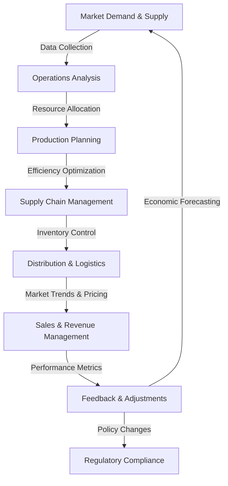

```.gitignore
.env
__pycache__
venv/
```

also create a requirements.txt file by piping pip freeze 
`pip freeze > requirements.txt`

You can install all the requirements via
`pip install -r requirements.txt`

