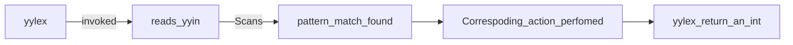
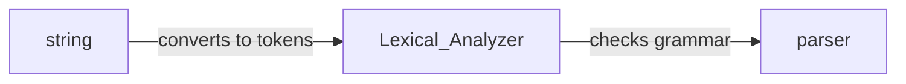
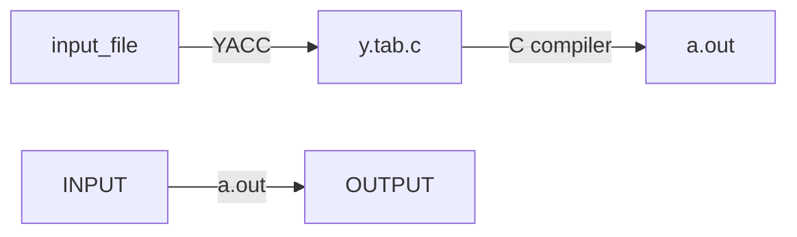

# Introduction to LEX
	tool for creating lexical analyzer.

	Use LEX to specify a regular expression. The LEX converts this to C program that implements a Finite State machine. Compile the C program to get a.out. 

 ```mermaid
 flowchart LR
INPUT --> A.out
A.out --> OUTPUT
```
	Source SIL program is fed to LEX Analyzer which produces tokens. 
	A token is a single element of SIL Programming language that is recognized by the compiler.
	eg: int, boolean, begin, end, while, if

`“integer” {return ID_TYPE_INTEGER;}'

	Lets see an exapmle of LEX to detect integer and return ID_TYPE_INTEGER when it is seen.
	- A Lex contains of a pattern part and an action part

### THE STRUCTURE OF A TYPICAL LEX PROGRAM
```
DECLARATIONS
%%
RULES
%%
AUXILIARY FUNCTIONS
```

#### Declaration
	1) Regular definitions
	2) auxiliay declarations

```
Example:
%{
	#include<stdio.h>
	int global_variable; //Auxiliary declarations
%}
number [0-9]+ //Regular definitions
op [-|+|*|/|^|=]
%%
/* Rules */
%%
/* Auxiliary functions */

```

	regular definitions are of the form A B where A is the name given to the RegeX B
	eg: num [0-9]+
#### Rules
	1) Pattern to be matched
	2) Action to be taken
```
/* Declarations*/
%%
	{number} {printf(“ number”);}
	{op} {printf(“ operator”);}
%%
/* Auxiliary functions */
```
#### Auxiliary Functions
	We can include our own C functions to the lex.yy.c output file if we specify it in the Auxiliary functions place.
```C
	/* Declarations */
%%
	/* Rules */
%%
int main()
{
	yylex();
	return 1;
}
```

### yyvariables
		1) yyin
			- similar to cin. Defaluts to console input.
			- Specify inside Auxiliary functions before calling yylex()
	---------------------------
	/* Declarations */ 
	%% /* Rules */ %%
		 main(int argc, char* argv[]){ 
		 if(argc > 1) { 
			 FILE *fp = fopen(argv[1], “r”) 
			 if(fp) yyin = fp; 
		 } 
		 yylex(); 
		 return 1;
	  }
	---------------------------------------

	2) yytext
		- yytext is of type char*. Contains the lexeme currently found. A lexeme is a sequence of characters that matches some pattern in the rules section. Value will be overwritten when yylecx() is called.
```C

	number [0-9]+
%%
	{number} {printf("Found : %d",atoi(yytext));}
%%
int main()
{
	yylex();
	return 1;
}
```
	3) yyleng
		- Is an int that contains the length of string pointed to by yytext.

### yyfunctions
	1) yylex
		- yylex() has return type int.
		- LEX automatically definex yylex() in lex.yy.c but doesn't call it. We have to all it in auxiliary fucntions.


	yylex keeps scanning until a pattern match is found or input ends.
	If none of the rules have return statement it waits infinitely for input or until EOF is reached.
	if yylex() is called more than once, it resumes from the last read place. 

	2) yywrap
		- no definition is provided. 
		- not declared by LEX
		- has a return of 0 (false) or positive number (true)
		- when postive is returned yylex() stops scanning input and returns. On false yylex() keeps scanning.
		- programmer either has to define yywrap in auxiliary part or provide %optionnoyywrap in declarations section.
```C
/* Declarations */
%%
/* Rules */
%%
// yywrap will be called twice. In first call yyin is not set to newfile_pointer, so it return 0 and continues execution. In second call yyin points to newfile_pointer and return 1 which wraps up yylex().
int yywrap() {
	FILE *newfile_pointer;
	newfile_pointer = fopen(“input_file_2.l”,”r”);
	if(yyin != newfile_pointer){
		yyin = newfile_pointer;
		return 0;
	}
	else
		return 1;
}
int main() {
	yyin=fopen(“input_file.l”,”r”);
	yylex();
	return 1;
}
```

```C
%{
	/*
	1.Request input of an even and an odd number
	2.indicate input characteristic : Even/Odd [digit_length]
	3.check for input's correctness and print result
	*/
	#include<stdlib.h>
	#include<stdio.h>
	int number_1;
int number_2;
%}
	number_sequence [0-9]*
%%
{
	number_sequence}[0|2|4|6|8] {
	printf("Even number [%d]",yyleng);
	return atoi(yytext);
}
{
	number_sequence}[1|3|5|7|9] {
	printf("Odd number [%d]",yyleng);
	return atoi(yytext);
}
%%
int yywrap
{
	return 1;
}
int main()
{
	printf("\nInput an even number and an odd number\n");
	number_1 = yylex();
	number_2 = yylex();
	int diff = number_1 - number_2;
	if(diff%2!=0)
		printf("\nYour inputs were checked for correctness,	\nResult : Correct\n");
	else
		printf("\nYour inputs were checked for correctness, \nResult : You do not know how to read\n");
	return 1;
}
```
# Disambiguation rules
	1) longest match is given priority
	2) Order of occurence is assigned as the pattern's matching priority.

```
	“break” { return BREAK; }
	 [a-zA-Z][a-zA-Z0-9]* { return IDENTIFIER; }
here 
i/p : break
	will be identified with return BREAK;
```

```
“-” {return MINUS;}
“--” {return DECREMENT;}
i/p : -            o/p: MINUS
i/p : --           o/p: DECREMENT
```

## Pattern matching using LEX
	Conceptually LEX uses a fininte state machine to recognize all the regualr expressions. Code written by programmer in action part is executed when FSM is in action part. Internally it keeps a transition table (decision table).
	A -transition(current_state, currrent_char)- is used to access the transition table. 
	
	If we compile with -T flag decision table will be visible in lex.yy.c

## Token Simulator program

```C
%{
/* Scan and return a token for identifiers of the format :
(string)(number)
Note : strings are not case sensitive
examples : a0 , A1 , ab2 , AB4 , aBc5
*/
#include<stdio.h>
#define ID 1 //Identifier token
#define ER 2 //Error token
%}
	low_case [a-z]
	upp_case [A-Z]
	number [0-9]
%option noyywrap
%%
	({low_case}|{upp_case})({low_case}|{upp_case})*({number}) return ID;
	(.)* return ER;
%%
int main()
{
	int token = yylex();
	if(token==ID)
		printf("Acceptable\n");
	else if(token==ER)
		printf("Unacceptable\n");
	return 1;
}
Scans from console and outputs where input is of form {[a-z][A-Z]}+{[0-9]}
```

# Construction of a DFA from a regular expression
	1) Constructing the Syntax tree
	2) Constructing the DFA from the syntax tree

### Constructing the Syntax tree
#### The intermediate syntax tree
	In a syntax tree leaves are terminals and inner nodes are operands. 
	| -> any of the leaves
	* -> any number of the leaves
	º -> concatenate the leaves

![[Pasted image 20250110220625.png]]
	Syntax Tree for {[a-z]   [A-Z]} + [0 - 9] 

	The subscript here indicates the postions of the leaf.

#### Constructing the DFA
	1) Constructing the set of states of the DFA
	2) Constructing all the possible transisitions from one state to another.
##### Constructing the set of states of the DFA
	find Start Symbols.

![[Pasted image 20250110221809.png]]

	I - > start state { 1, 2}
	II -> {3 , 4, 5}
	III -> accept state.
#### Constructed DFA

![[Pasted image 20250110221900.png]]

#### DFA simulation algorithm
```C
DFA_simulator()
current_state = start_state
c = get_next_char()
while(c != EOF)
	current_sate = transition(current_state , c)
	c = get_next_char()
	if(current_state ∈ Final_states)
		/*ACCEPT*/
	else
		/*REJECT*/
```


																LEX IS JUST A TOOL THAT GENERATES A SMART SCANNER IN C
	Lexical analyser only checks for recognizable patterns. It does not check for syntax. Syntax analysis is done by the parser.




![[Pasted image 20250110222540.png]]

	 YACC is the parse used to verify the tokens generated by yylex().


# YACC

	Parser for SIL. Yet another compiler compiler.

	A tool to generate a parser.



	The source SIL language is fed into the a.out executable, which decides whether the language is grammatically correct.
	The Sytax of SIL can be specified using a context free grammar. YACC takes the specification and turns into a parser.


## Context Free Grammar
	Consists of 4 parts
	1) Terminals (in out case tokens)
	2) Non-Terminals
	3) Set of P, Productions
	4) Start variable S

#### Sample  Infix to Postfix converter YACC program
```
start: expr '\n'	{exit(1);}
     ;
expr:  expr '+' expr	{printf("+ ");}
    | expr '*' expr	{printf("* ");}
    | '(' expr ')'
    | DIGIT		{printf("NUM%d ",pos);}
    ;
```
	Non-Terminals : {start, expr}
	Terminals : {'\n', +, *, DIGIT, (, )}
	
	I : 3 + 5
	O : NUM1 NUM2 +
	I : 3+(1*9)+5  
	O : NUM1 NUM2 NUM3 * + NUM4 +

	Each rule has a production part and an action part.
		The Action part consists of C statements enclosed in { }
		Each production part has a head part and a body part separated by  : ,
		
	-- start: expr '\n'	{exit(1);} -- 

	In this start is the head part and everything after the : is the body part.
	The Parser reads the input sequentially and tries to match with body of each production. When found the action part is executed and continues reading the input.


### yyparse()
	the y.tab.c file contatins a fucntions yyparse() which the C implementation of a pushdown automata. yylex() is invoked by yyparse() to read tokens from the input file. yylex() for yyparse() must be provided by the programmer, use LEX for generating.
	yylex() is repeatedly called for finding all the tokens.


#### Structure of YACC program
```C
DECLARATIONS
%%
RULES
%%
AUXILIARY FUNCTIONS
```
##### Declarations
	1) C declarations 
	2) YACC declarations

```python
/* Beginning of Declarations part */
%{
    /*Beginning of C declarations*/
    /*End of C declarations*/
%}
    /*Beginning of YACC declarations  */
    /*End of YACC declarations */
/* End of Declarations Part */
%%
```

