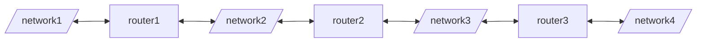
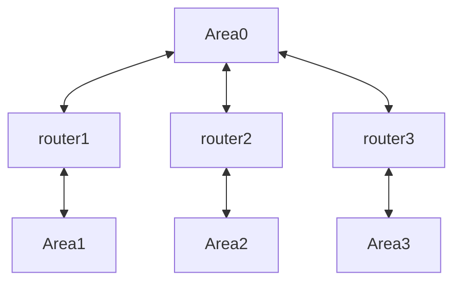

	- Install 6 VM's
	- INSTALL [traceroute, net-tools, wireshark, frr] (remeber to run sudo apt update to refresh packages)
	- In 3 VM's you need to add an additional network card
	- we need to use IP ranges 172.16.20.64/26 
		- This is 32 - 26 = 6 bits
		- we need to create 4 subnets so log(4) = 2 bits
		
	172.16.20.64
	A [1010 1100.0001 0000.0001 0100.01] {00} 0000 : in this first 2 bits can be further used to create 4 subnets
	B [1010 1100.0001 0000.0001 0100.01] {01} 0000 : 172.16.20.80/28 
	C [1010 1100.0001 0000.0001 0100.01] {10} 0000 : 172.16.20.96/28
	D [1010 1100.0001 0000.0001 0100.01] {11} 0000 : 172.16.20.112/28
	 - set the ip address to these (for 172.16.20.80 set it as 172.16.20.82, because 81 is gateway) with mask as 26 and 
	 - gateway as base ip + 1 (172.16.20.80 becomes 172.16.20.81)
Network Diagram


## My configuration
### Router 1a
	- mac_address : ...d2, ...02
	- network : intnet1, intnet2
### Router 2
	- mac_address : ...d0, ...06
	- network : intnet2, intnet3
### Router 3
	- mac_address : ...a9, ...9e
	- network : intnet3, intnet4
### NETWORKS
	- intnet1 : 172.16.20.64
	- intnet2 : 172.16.20.80
	- intnet3 : 172.16.20.96
	- intnet4 : 172.16.20.112
	- WHILE ASSIGNING NETWORKS I FOLLWED THE ORDER THAT enp0s3 then enp0s8
## How to create internal network
	- go to each indivual VM in virtualbox and set the network to internal network, 
	- with the name as intnet1, intnet2 for the first VM, first NIC gets intnet1 and second gets intnet2 etc.
	- do it for all the VM's
	- router1 : intnet1, intnet2
	- router2 : intnet2, intnet3
	- router3 : intnet3, intnet4
### Adding routes
	- at this stage you should be able to ping 172.16.20.83 from routera and vice versa (with ip 172.16.20.82)
	- this means everything is working properly

```c
'To add a route'
ip route add <network_ip>/<cidr> via <gateway_ip>
example : ip route add 10.0.3.0/24 via 10.0.3.1

'To delete a route'
ip route del <network_ip>/<cidr>
```
	- HOW SHOULD YOU SET THE ROUTE
		- Go to machine1
		- this machine is connected to network1 and network2. 
		- It has no access to network3
		- But machine2 has access to network2 and network3
		- So in theory we can access network3 via machine2
		- So now we need to add a gateway such that whenever a request comes to address of network 3 in machine 2 it need to be redirected to a network that is common to both the networks
		- Our setup will be a linear one
		- So if I ping network4 from machine1 it should go through machine2 and reach machine3
		- also note that the gateway address should be set as the address of the neighbour machine (we are using the machines as routers, so routers address should be the gateway address)
		- gateway meaning if we can't find the address in our network forward it to this address (it works by looking for the best matching prefix if multiple gateways are present)

```C
sudo sysctl -w net.ipv4.ip_forward=1
add this to all 3 VMs to enable forwarding, basically enabling to act as routers.
```
IF everything is done properly your routing table (shown with `route -n` will look as follows)
![[Pasted image 20250326151252.png]] 
![[Pasted image 20250326151348.png]]
![[Pasted image 20250326151307.png]]
# What is RIP protocol
	- Routing Information Protocol (RIP)
	- One of the oldest distance vector routing protocol used in small to medium sized networks.
	- RIP uses UDP port 520 for communication
	- operates at layer 3 of the OSI model
	- if calculates the best path for a packet by analysing the hop count of each packet. A lower hop count means it passed through less number of routers on its way. 
	- it has a maximum hop count of 15. A hop of 16 means the host is unreachable
### Setting up RIP in linux
	- install frr
	- type in 'sudo nano /etc/frr/daemons'
	- change ripd=no to ripd=yes
	- then restart the service by 'sudo systemctl restart frr'
	- no do the following for each VM
```C
sudo vtysh
 'In the following program'
 configure terminal
 router rip
 network <ip_addr_range of network 1/28>
 network <ip_addr_range of network 2/28>
 exit
 exit
 write memory
 exit
```
	- disconnect and reconnect network in settings to refresh.
If everything goes successfully this should be the routing table
![[Pasted image 20250326172838.png]]
![[Pasted image 20250326172849.png]]
![[Pasted image 20250326172858.png]]

# OSPF
	- Open Shortest Path First
	- Part of a link-state routing protocol family.
	- LINK STATE PROTOCOL
		- routers exchange information about their directly connected links (interfaces) and their states
		- each router builds a complete network topology (link-state database)
	- OSPF supports areas
		- areas logically divide many routers into a single group
		- Area 0 aka backbone area
		- all other routers must connect to area 0 through a link or directly



# Setting up RIP in pfsense
# Setting up web configurator
	- install pfsense, you can mostly enter, enter... and for disk selection use spacebar then enter
	- after installation restart, (remember to remove the disk from devices in VM panel settings)
	- after boot wait
	- click on option 1 to set interfaces
	- you should have added 3 network interfaces in VM settings earlier
	- so here 
	- eth0 -> WAN
	- eth1 -> LAN
	- eth2 skip for now, we will setup later
	- press enter and continue
	- now click option 2
	- for ipv4 dhcp server say no, beacuse we need to set it up manually
	- you will be prompted for an IP address here you should give 172.16.20.65 (this will be the routers ip address, all the machines connecting to this network will send packets to this ip like a gateway)
	- next bit mask size should be 28
	- next you will have to add a dhcp server ip range
		- type in range 172.16.20.66
		- follwed by 172.16.20.79
		- remeber that we divded the network into four parts and now has 16 host machines to work with (ie 4 bits)
	- for ipv6 dhcp say yes, because we are not setting it up for now
	- for web configurator say yes
	- and done!
	- now Go to VBox and add another machine with same internal network as NIC1 of your router. Here it should be intnet1
	- immediately after logging in you should autmocatically be assigned an ip address in the range of 172.16.20.(66 - 79), just like we added in the router settings
	- now go to the addrss http://172.16.20.65
	- you should be prompted for username and password which in admin/pfsense
	- you have now completed web configurator setup.
## Enabling Internet
	 - first you need internet access
	 - go to services->DNS resolver
	 - enable DNS resolver, add tick forwarding mode
	 - goto general setup and add 2 DNS services (1.1.1.1, 8.8.8.8) and also choose the correct time zone (asia/kolkata)
	 - now your pfsense should have internet access
	 - goto general -> pacakges and search for frr
	 - install frr package
## Enabling RIP
	- goto services -> RIP global/zebra 
	- enable FRR and save
	- goto RIP and enable RIP

Here RIP routing should be enable and you should add two networks (depending on the router number this will vary)
for router 1 it should connect intnet1 and intnet4 so ip address should be ...20.64/28 and ....20.112/28. 
![[Pasted image 20250327201156.png]]
	
	- write the configurations properly and save
	- next go to interfaces tab and add two interfaces LAN1 and LAN2
	- next goto INTERFACES and click on LAN2(it might be named OPT1 rename it by editing it)
	- you need to set the ip address as follows
	
![[Pasted image 20250327201455.png]]![[Pasted image 20250327201503.png]]
	 
	 - click save and continue
	 - next you need to add a dhcp server so that every machine that connects to this networks automatically gets an IP. we have already done it for LAN1, now we need to do this for LAN2
	 - goto services -> DHCP server
	 - click on LAN2 and add the configurations
	 - click enable DHCP server add the ip address

![[Pasted image 20250327201715.png]]
	
	- Next we need to add a firewall rule to allow all packets to go in and out freely
	- Goto firewall -> rules and click on LAN2
	- tick on log packets (will be useful for demo purpose)
	- click add and select protocol to any
	- and save

	Now repeat this process for 3 more routers with the correponding ip address

| Machine | NIC1    | NIC2    | IP1          | IP2           | LAN1         | LAN2          |
| ------- | ------- | ------- | ------------ | ------------- | ------------ | ------------- |
| router1 | intnet1 | intnet4 | 172.16.20.64 | 172.16.20.112 | 172.16.20.65 | 172.16.20.113 |
| router2 | intnet2 | intnet4 | 172.16.20.80 | 172.16.20.112 | 172.16.20.81 | 172.16.20.114 |
| router3 | intnet3 | intnet4 | 172.16.20.96 | 172.16.20.112 | 172.16.20.97 | 172.16.20.115 |

	- create 3 VM's with network set to internal network.
	- VM1 -> intnet1
	- VM2 -> intnet2
	- VM3 -> intnet3
	- You should be able to ping every combination of VM's even though no two are in the same internal network 
	- You have completed routing using RIP
	- check diagnostics -> routes in pfsense to see the routing table genrated

## OSPF (open shortest path first)
	- This uses concept of areas.
	- area's are a way to group together routers
	- There is master area called backbone (ip: 0.0.0.0). Through which all the other areas are connected.
	- In our case backbone in intnet4
This will be our network diagram. While configuring OSPF we will be referring this.
![[Pasted image 20250327203940.png]]

	- first goto RIP setting and disable it
	- goto OSPF and enable it.


![[Pasted image 20250327204419.png]]

	- click save and continue
	- do this for all 3 routers
	- boom. you have done routing with OSPF.
	- try pinging pair of client VM's to see if it works.
	
	