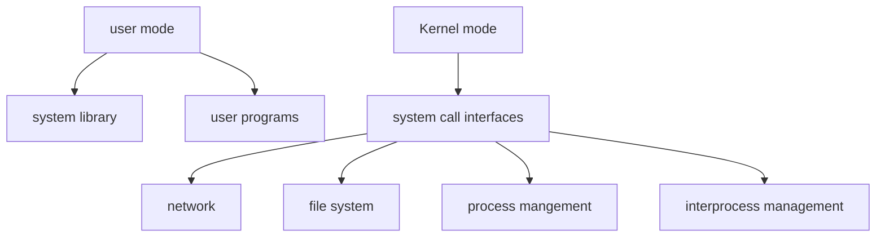
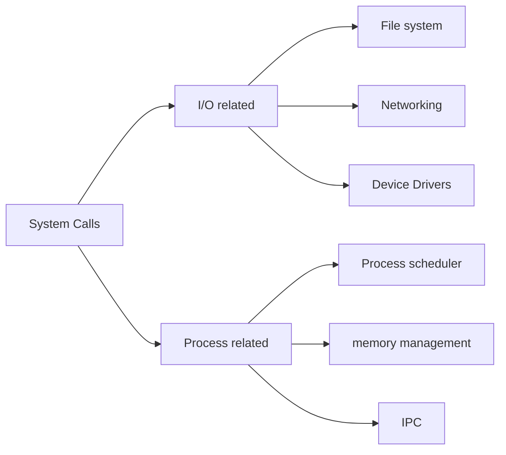
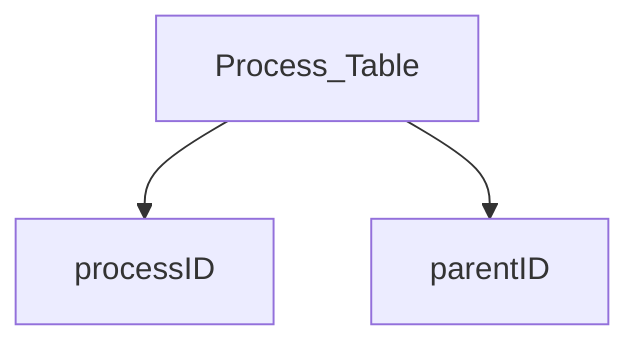
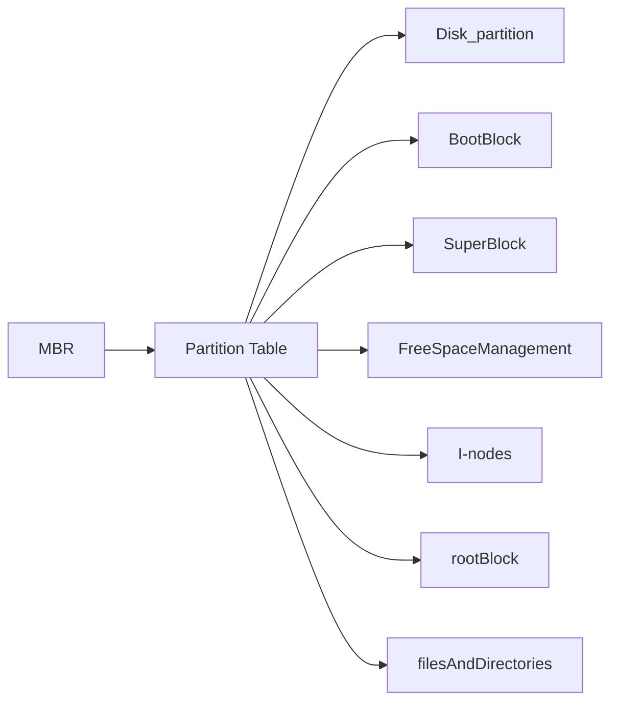
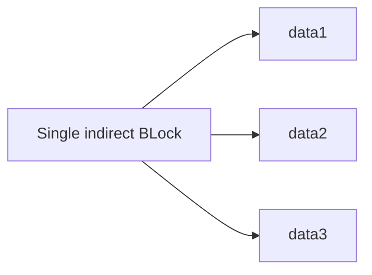
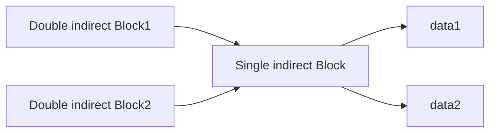
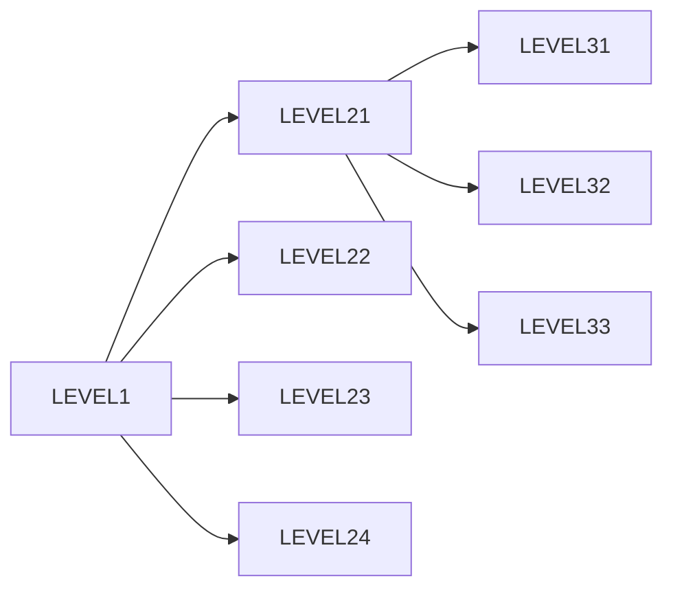
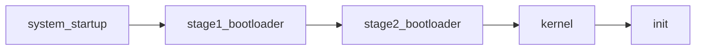

# Linux 
	1) user mode
		1) system library
		2) user programs
	2) kernel mode
		1) system call interfaces
			1) network system 
			2) file system
			3) memory management
			4) process management 
			5) interprocess communication
			6) device drivers
	3) hardware
		1) Network interface cardss
		2) CD ROM
		3) hard disk
		4) cpu
		5) RAM





	Kernel has special permission to execute in hardware level.

## System Calls
	1) increse system securtiy
	2) lets system take care of hardware-specific issues
	3) interface between user process and hardware
	4) System calls : open, close, read, write, fork etc.

### Conversion of C code to system calls


==<unistd.h> library provides low level system call API's==

### Invoking a system call
	User Mode
		1) system call invocation in application program
		2) C library wrapper routine : includes memory address of kernel mode sys call handler
	Kernel Mode
		1) system call handler : calls system call
		2) system call service routine : process and returns a result

	Linux treats everything as files.
			devices, drivers, directories, shell etc
			1) device file (char or block file)
			2) directory file
			3) ordinary file
	Files -> read, write, execute -> owner, group, others
	ProcesS Controlled by kernel. All process maintained by kernel in memroy called process table PCB

	Use fork() execv() to create processes.

# File Management
	File system must keep track of which blocks of physical memory belongs to which files.
	What order the blocks should follow to create the file.
	which blocks are free for allocation.
	If something is not a file it is a process.
## File system layout

	Partition table header is displayed here. The rest of the block is omitted.
	Has the following order
		1) Boot Block
		2) Super Block
		3) Indoe List : contains info about files
		4) Data Blocks
		5) Blcoks are of size 512/1024 bytes
	Need to optimize for access time and efficient space usage.

### Free Space management
	System maintain a free space list, that conatins all the free blocks.
	1) Bit Vector
		1) Stores a long list of 1's and 0's that say which blocks are free/not
		2) Only useful when kept in main memory and occationally written to disk for recovery.
		3) not very efficient. A 1GB storage with 512 byte blocks need 2^30 bytes/ 2 ^ 9 bytes = 2 ^ 21 bytes           => 2 ^ 21 bits needed, 2 ^ 18 bytes or 256KB 
	2) Linked list
		1) link all the free block in a list
		2) cant get contiguous space
		3) no fast access, need to traverse list, it size constraint not met
	3) Grouping 
		1) Stores the address of n free blocks in the first free block, then the last block contains the memory of the next n free blocks.
	4) Counting
		1) based on the fact that contigous blocks are free together
		2) store the number of free  blocks following a free block in a list.
		3) the individual entry would be longer but overall it would be shorter as we are storing multiple blocks per entry.

### File allocation methods
	1) Contigous Allocation
		1) simple to implement, good for random access
		2) files cant grow, wastes space, Unused space is preallocated, may never be used.
	2) Linked Allocation
		1) Simple to use, need only starting address
		2) saves space.
		3) But random access is hard.
			1) FiLE JEEP (starting address 0x0001 : Ending address 0x0003)
	3) Indexed Allocation
		1) Collect all block pointers to an index block.
		2) Random access is easy, no fragmentation
		3) overhead of Index Block
			1) File JEEP 
				1) INDEX BLOCK : 34
					1) INDEX BLOCK 34 : 
						1) 2,46,34,6,23,4,1,62, -1, -1, -1, -1, -1, -1, -1 (size powers of 2)
	4) Unix i-Node
		1) mode
		2) owners
		3) timestamps
		4) size of block
		5) count
		6) direct blocks -> (data1, data2, data3)
		7) single indir
		8) double indir
		9) triple indir

#### UNIX i-Nodes
	Inodes doesn't store filename. There is mapping from inode number to filename.
	indir are pointers to special blocks that contain addresess of data blocks. This is used when inode doesn't have enough capacity to store all the direct pointers.







same for triple indirect block


```SCSS
Inode → Triple Indirect Block → Double Indirect Block → Single Indirect Block → Data Block
```

#### Directory structure
	1) Collection of nodes containg info on all files.
	2) Single Level Directory
		1) issues in naming, grouping
	3) Two Level Directory

	4) Tree Structured Directory
		1) Combination of different levels.


#### VFS virtual file system
	Abstracts physical layout to logical layout. 
	VFS is a kernel software that handles all system calls related to file systems. Its main strength is poviding a common interaface to several kinds of file systems.
	Multiple file systems can coexist thanks to VFS.
	Kernel translates abstract to actual.


# PC BOOTiYY HAHHAH
	1) Power supply switched on
		1) power supply does a self test.
		2) when voltage and current levels are accpeted, the supply sends the "power is stable" signal to the processor. usually takes .1 to .5 seconds
		3) Timer chip stops sending the reset signals to processor allowing cpu to begin
		4) CPU starts executing ROM BIOS code.
			1) executes the FFFF:0000 code. Meaning the last 16 byte. (segement : offset) the 16 bytes is a jump instruction that points to the correct section of code.
		5) any errors at this point will be reported by beep codes.
		6) BIOS searches for adapters that need to load their own ROM BIOS routines (eg: video cards)
		7) XXXX ROM error XXXX is the segment address.

physical address = 16 * segment  + offset ( the result will still be in hexadecimal, we are just offsetting the segment by one place). 
`FFFF:0000 = FFFF * 16 + 0 = FFFF0 + 0 = FFFF0`
	
	8) ROM BIOS checks to see if its a cold start or warm start. checks value at memory 0000:0472 to see if its 1234h, any other value means it is a cold start.
	9) if its a cold start : 
		1) ROM BIOS executes a full POST
		2) if warm start :
			1) skips the memroy test.
		3) FATAL and NON FATAL errors.
			1) FATAL error stops the system from booting up and beep codes are send.
	10) OPERATING SYSTEM TAKES OVER
	11) MBR occupies the very first sector at cylinder 0, head 0, sector 1. It is 512 bytes in size. The sector is loaded and a valid signature is tested. IF valid signature found it is loaded into memory
	12) With a vaid MBR loaded the BIOS transfers the boot process to the partition loader code that takes up most of the 512 bytes of the MBR.
		1) The MBR conatins bootloader, 4 entries for four partitions, and last 2 bytes with data 0xAA55 which acts as validation check of the MBR.
	13) Parition Table : loader searches for a parition marked as active. Then searches the first sector of that parition for a boot record. If a valid signature is found, the boot sector code is executed as a program.


## Linux Booting

	bootloader in MBR loads the linux kernel
	GRUB and LILO are the most popular linux bootloaders.
	First thing kernel does is to execture init program.
	init is the parent of all processes exectuing on linux.
	init has process id 1
	starts multiple instances of getty which waits for console logins which spawn one user shell process.
### Initab file
	Specifies which processes are started at bootup and during normal operation. Computer will be booted to the runlevel as defined by initdefault directive in the /etc/inittab file.
#### Run levels
	init could be in any of eight runlevels (0 - 6)
	
![[Pasted image 20241119153438.png]]

# Linux File System Implementation
![[Pasted image 20241119182445.png]]

	superblock contains info about the filesysem (type of fs, number of blocks)
		1) size of file system
		2) number of blocks
		3) a list of free blocks
		4) size of inode list
		5) number of free i-node in filesystem
	i-nodes conatin info about files.
	1) data structure that describes attributes of a file including the layout of its data on disk
	2) contains information necessary for a process to access a file
	3) 2 types of iNode
		1) disk copy that is used when file is not active
		2) and Incore copy that reads information of the active file

## iNode Structure
	1) file owner identifier
	2) file type 
	3) file access permission
	4) file access times
	5) number of links to that file
	6) file size
	7) table of contents for the disk address of a data in a file.
	8) the contents of a inode change when you change the contents of a file, ownership, link settings.
	9) in memory copy of inode is called incore inode

#### Directories
	Directories are files that give the file system its hierarchial structure.
	Plays an important role in converting file name to an inode number.
	A file whose data is a squence of entries, each consisting of an inode number and the name of file contained in the directory.

#### Buffer cache
	Buffer pool to minimize disk access. Maintained by kernel.


##### getblk algorithm
	searches buffer cache for a block
		IF present return the block
		ELSE load block and return

##### bread
	allocates buffer for a block and reads data into the buffer
##### bwrite
	copies data back to disk from buffer.

##### breada
	block read-ahead algorithm

##### ialloc & ifree
	assigns and removes a disk i-node to a newly created file

##### alloc & free
	assigns and removes a disk block to a newly created 
##### iget, iput
	controls allocation of incore i-nodes when the process access a file.
	iget allocates an incore copy of an inode.
	kernel maps the device number and inode number to search.
	- if it can't be found, allocate new one
	- kernel then copies the disk copy to incore 
##### namei
	converts file names to inode number used internally by the kernel.
	parses the pathname one by one
		/etc/dev/stc1
		finds inode of etc
		then finds inode of dev and makes sure it working inode of directory and so on.
		1) tokenize the input pathname	
		2) `/home/user/file.txt` becomes `["home", "user", "file.txt"]`.
		3) locate the directory entry for the component using cureent directories inode.
		4) check for file permissions
### **Example: Resolving `/home/user/file.txt`**

1. Start at `/` (root directory inode).
2. Locate `home` in `/`’s directory entries → fetch inode for `home`.
3. Locate `user` in `home`’s directory entries → fetch inode for `user`.
4. Locate `file.txt` in `user`’s directory entries → fetch inode for `file.txt`.
5. Return the inode for `file.txt`.


==You need execute permission for a directory to traverse its contents, even if you have read permissions==
#### bmp
	locates disk blocks of a file


### open()
	fileDescriptor = open(pathname, flags, modes);
	pathname : file name
	flags : type of open
	modes : file permissions
		RETURN an integer called the file descriptor
	every process has a file descriptor table managed by the operating system.
	the fd is merely an index for this table.
	this table maps the fd to 'struct file' that stores file information
	INPUTS : file name, type of open, file permissions
	OUTPUT : convert file name to inode (using namei)
		allocate file table entry, initialize count, offset, allocate user file descriptor entry, set pointer to file table entry.


##### read()
	number = read(fd, buffer, count)
	use the fd from open.
	count = number of bytes user wants to read.
	number = number of bytes actually read.
		INPUT : file descriptor
			address of buffer
			number of bytes to read
		OUTPUT : 
			check file table descriptor for fd.


# IPC Signals
	How does a process recieve a signal?
		Kernel set the respective bit in process entry table
	When process will handle signal?
		when process returns from kernel mode to user mode.
## Signal Handling
	1) ignore the signal
	2) execute the default action
	3) execute user defined signal handler

Signal(signal_number, SIG_IGN)
Signal(signal_number, SIG_DFL)
Signal(signal_number, signal_handler)

## Signals continued
	Signals are a way of sending simple messages to processes without the need for polling.
	Signals are asynchronous events meaning they can happen anytime.
	LINUX Signal corresponds to an event : 
		it is raised by one process (or OS) to call another proces's attention.
		It can be caught by subject process, like the c program we wrote that caught SIGINT

### Signals
	SIGHUP (hangup) : send to every process in control terminal, when the terminal is closed.
	SIGINT (interrupt) : ask politely a process to terminate (ctrl + c)
	SIGQUIT (quit) : ask a process to terminate and create a core dump
	SIGKILL (kill) : force a process to terminate
	SIGTSTP : (ctrl + z) causes the system to send an TSTP
	SIGABRT : (ctrl + /) smae as ctrl + c sends an abort signal.


### Signal transmission

#### Signal transmission
	kernel updates the data structure of destination process to represetn a new signla has been sent
#### Signal Delivery
	kernel forces the process to react to the signal by changing its execution state. by starting a specified singal handler.

==SIG_IGN : ignore the process
SIG_DFL : default signal handler==


# Deadlock
	Multiprogramming creates env for concurrent processe to execute
	Processe cooperate by sharing data. Cooperation is important for several reasons:
		speedup, modularity, info sharing

## Synchronization problem
### Critical Section
	
### Deadlock
	occurs when there are atleast two process waiting for each others resources.
	1) prevention
	2) avoidance
		1) analyze a prospective state before entering it to guarentee that every process can still exectue.
		2) when a process is created it must declare its maximum claim.
	3) detection & recovery
	4) manual intervention : restart system when it gets slow.
Things Necessary for deadlock
	1) mutual exclusion
	2) hold and wait
		1) force process to acquire all resources at the beginning
		2) if a process wants to acquire a resource it must release all first, then reacquire.
	3) circular waiting
		1) there is a cycle in the graph of process and resources 
		2) dining philosophers, semaphore solution
	4) no preemption
If on of these conditions fail then there is no more deadlock.

#### DINING philosophers
	philosopher either eating or thinking
	when thinking he doesn't talk to others
	a philosopher uses 2 chopsticks
	there are 5 philosophers and 5 chopsticks.

![[Pasted image 20241119223429.png]]

	cant pick up both forks at the same time. Has to pick up individually.
	represent each chopstick with a semaphore.
	a philosopher execute a wait() on the fork. 
	a philosopher relaseas by doing signal() on the fork.
	
	wait(chopstick[i])
	wait(chopstick[( i + 1 ) % 5])
	...
	//eat
	...
	signal(chopstick[i])
	signal(chopstick[(i + 1) % 5])
	...
	//think
	...
	This could create a deadlock
		all philosophers get hungry at the same time. all grab the left chopstick at the same time. Now everyone is delayed forever on the right chopstick.
	Solutions : allow philosopher to pick up forks at the same time, introduce a critical section
	allow only four philosophers at the same time.


### Bankers algorithm
	pick a process  that can be completed, do it, then free all of its resources.


# Memory binding

## Compile time binding
	the address is binded from logical to physical during compilation itself. This means the program should be loaded into the same memory space everytime.
## Load time binding
	the compiler produces relocatable code. and it is binded to physical address during loading phase. the os determines the starting address of the program.
		ie 14 from start ==> 14700 + 14 during loading

## Execution time binding
	binding occurs dynamically at runtime.
	supports virtual memory and processes that may be moved between physical memory location during execution.
	Requires hardware support for converting logical to physical address on the fly.