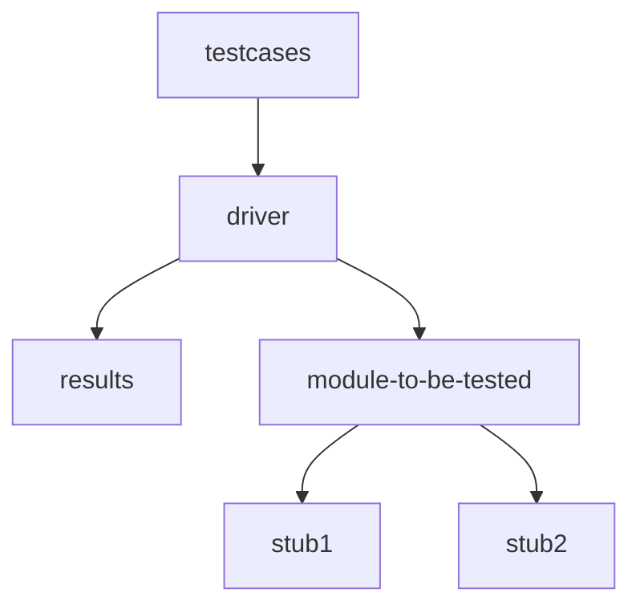

# Software Testing
	- What ? to find out errros in the software
	- testing begins in the small and progress to the large
	- test specification documents
	- testing also called verification and validation
	- verification - "are we building the product right?"
	- validation - "are we building the right product"
	- Two team
		- software developers
		- independent software testing teams
	- Four steps of testing
		- unit testing
		- integration testing
		- validation testing
		- system testing

## Unit Testing
	1) Interface - test data flow across the components
	2) Local Data Structures - analysis of local data structure and impact on global variables
	3) Boudary Conditions - test the boudary conditions
	4) Independent paths - identify erroneour computations, inccorect control flow or incorrect comparisons
	5) Error handling paths - to test the error handling paths


	- Stub - invoked by the component to be tested
	- Drivers - "main program" that accepts the test case data and invoked the component to be tested.
## Integration Testing
	- Interfacing is the need for this
	- systematic technique for constructing the software architecture while at the same time conducting tests to uncover the errors associated with interfacing.
	- Two approches
		- Big Band approach
		- Incremental approach	
			- Bottom Up approach 
			- top down approach
### Top Down Approach
	- either a depth first or breadth first manner
	- Main control module is treated as a test driver and subordinates are replaced with a stub
	- subordinates stubs are replaced with actual components over time.
	- test is completed
	- another stub is replaced
	- regression testing (involves rerunning tests after a certain change has been made to the program)
#### Limitations
	- stubs are used inplace of subordinates of main module
		- SOLUTIONS
		- delay tests until stubs are replaced with actual modules
		- develop stubs that perform limited functions
		- start integration from bottom up
### Bottom Up Approach
	- need for stubs are eliminated
	- low level components are clubbed together into clusters
	- a driver is written to coordinates test case input and output 
	- a cluster is tested. 
	- drivers are removed and clusters are removed moving upward

# Testing
## Regression Testing
	- Re-execution of a subset of tests to ensure that changes have not propagated any unintented side effects.
	- Includes 3 categories of tests
		- a general set of tests that checks all the general functionality of the tests
		- additional tests that focus on the software functions that could be affected by the changes
		- tests that focus on the software component that was changed.
## Smoke Testing
	- A build includes all the data files, libraries, reusable modules and engineered components that are required to implement one or more product functions
	- tests are designed to expose hidden errors that will keep the build from properly doing its functions
	- the build is integrated with other builds and smoke tested everyday.
## Validation testing
	- Configuration review
		- to ensure that all elements of the software configuration have been properly developed, are cataloged and have the necessary details
	- Alpha testing
		- the alpha test is carried out at the deveopers suite with a representative group of end users.
	- Beta testign
		- conducted at one or more end user sites
	- acceptance testing 
		- customer perfoms a series of specific tests
## System testing
	1) recovery testing
	2) security testing
	3) stress testing
	4) perfomance testing
	5) deployment testing

### Debugging process
	When a test case uncovers an error, it is debugged
	Debuggin has 2 outcomes
		1) the cause will be found and corrected
		2) the cause will not be found

### Debugging strategies
	1) brute force : Print debuggin, going through memory-dumps, log files stack-traces to find clues
	2) back tracking : back tracks through the execution path to find out why the error occured
	3) cause elimination : hypothesis for why the error occured is construccted and either the code is directly changed or test cases are written to test whether the hypothesis is correct
	4) automated debugging : tools are used
	5) bisect : previous versions of the software are examined until a version with no error is found

## Software Test Case design
	- Test case design focuses on a set of techniques for the creation of test cases that meet the overall testing objectives and the testing strategies
	- Goal:- create a series of test cases that have a high likelihood of finding errors.
### Testablity
	- operability : the better it works the more efficiently it can be tested
	- observability : what you see is what you test
	- controlability
	- decomposability
	- simplicity
		- functional 
		- structural 
		- code
	- stability
	- understandability
## Internal and External view of testing
### White box testing
		- tests some fundamental aspect of the system with little regard for the internal structure of the software
		- it focuses on testing the code's logic, paths and internal workings.
		- all independent paths inside the module are exercised
		- exercise all logical decision on true and false sides.
		- execute all loops in their boundary and within their operational range
		- exercise internal data structure to ensure their validity
#### Basis path testing
	- enables the test case designer to come up with a complexity for the procedural design and use that to create a basis set that follows all the execution path atleast once.
	- flow graph notation
Flow Graph Notation picture
                                                                    ![[Pasted image 20250324172608.png]]

#### Compound Condition Statement
	- predicate node
	- region (if a space is surrounded by a set of edges then it is a single region, the picture has 3 regions)

Compound Condition Statement [picture]
														![[Pasted image 20250324172901.png]]
#### Independent program paths
	- An independent path is any path that introduces an addiontal processing statement or new condition in its path while traversing

#### Cyclomatic complexity
	- provides an upper bound on the number of test required
	- software metric that provides a quantitative measure on the logical complexity of a program
	- the number of regions on the flow graph corresponds to its cyclomatic complexity
	- V(G) = E - V + 2
	- V(G) = P + 1 (where P is the number of predicate nodes on the graph)


The flow graph has four regions.
	• V(G) = 11 edges - 9 nodes + 2 = 4. 
	• V(G) = 3 predicate nodes + 1 = 4.
										![[Pasted image 20250324173837.png]]

#### Graph matrices
	- a graph matrix is a square matrix whose col and row size are equal to the number of nodes.
	- each row and column corresponds to an identified node. and each entry in the matrix corresponds to a connection between the nodes.
	- LINK WEIGHT:
		- 0 means there is no connection
		- 1 means there is a connection
	- PROPERTIES OF LINK WEIGHT:
		  - probabilty that the link will be executed.
		  - processing time spend during the traversal of a link
		  - memory and other resources required during the traversal of the link


Picture of graph matrix next to a flow graph
										![[Pasted image 20250324195554.png]]


#### Control structure testing aka Condition Testing
	- focuses on testing each condition in the program to ensure it doesn't contain any errors.
	- a simple conditon is a boolen varialbe or a relational expression, possibly preceded by a ~
	- E1 <relational operator> E2
#### Data Flow testing
	- Data flow testing selects test paths of a program by considering definitons and uses of variables
	- DEF(S) = {X| X is defined in S}
	- USE(S) = {X| X is used in S}
	- it checks 
		- whether variables are used without initializing or initialized variables are not used at least once
		
DEFINITION USE CHAIN
		![[Pasted image 20250324201202.png]]
##### Example Calculation

Let's use the following code snippet as an example:

```c
int x; // Declaration, not a definition with a value 
x = 5; // Definition (D)
if (x > 10) { // Use (U1)     
	printf("%d\n", x); // Use (U2) 
} else {     
	x = x + 1; // Use (U3), then Redefinition (D')    
	printf("%d\n", x); // Use (U4) 
}
```

For the variable `x`, the DU chains are:
1. **First Chain**: `[D, U1]`
    - Definition: `x = 5;`
    - Use: `if (x > 10)`  
        This chain ends here because `x` is not used further if the condition is false.
2. **Second Chain**: `[D, U3, U4]`
    - Definition: `x = 5;`
    - Use: `x = x + 1;`
    - Use: `printf("%d\n", x);`  
        This chain applies when the condition is false.
3. **Third Chain**: `[D', U4]`
    - Definition: `x = x + 1;`
    - Use: `printf("%d\n", x);`  
        This chain starts after `x` is redefined

#### Simple Loop Testing
	- skip the loop entirely
	- run the loop once
	- two passes through the loop
	- m passes through the loop
	- n - I, n, n + I loops through the loop
#### Loop Testing
	- to fix the infinite loop repetition problem
	- to know the perfomance
	- to know the initialization problems
	- to determin the uninitilized variables

#### Nested loops
	- start at the innermost loops
	- keep the outer loops at minimum values and test the inner loops for out-of-range or excluded values
	- keep working outward until all loops are covered
#### Concatenated loops
	- if loops are independent use approach for simple loops
	- else use nested loops approach if not independent
### 	Black box testing
	- logical paths through the software and collaboration with the components are tested.
	- the tester has no knowledge on the internal working of the components. 
	- mostly includes providing input and checking the output
	- CHECKS FOR 	
		- incorrect or missing functions
		- interface errors
		- errors in data strutures or external databases
		- behaviour or perfomance errors
		- intitialization and termination errors
#### Graph based testing
Directed and undirected links in a graph
					![[Pasted image 20250324204447.png]]
#### Behavioral Testing methods
	- Transactional flow modelling
	- Finite state modelling
	- Data flow modelling
	- Timing modelling

##### Equivalence partitioning
	- Divides input data into different classes from which test cases can be derived
	-  Guidelines (VALID : acceptable range of values, INVALID: range of values that will be rejected)
		• Range- 1 valid and 2 invalid classes
		• Specific values- 1 valid and 2 invalid classes
		• Member of set, 1 valid and 1 invalid class
		• Boolean, 1 valid and 1 invalid class
###### Boundary value analysis
	- selection of input values that exercise boundary conditions
	- if range is from a to b. chooses values that barely bounds these values
	- test cases that produce maximum and minimum alowalbe table entries
	- exercies the data structures at its boundaries
##### Orthogonal Array Testing
	- Used when there are multiple input parameters
	- 2D array of numbers
	- any two columns give pair wise combinations
A sample OA (orthogonal array) with 9 test cases and 4 parameters each having values in range 1-3
										![[Pasted image 20250324211441.png]]
QUESTION
`Consider the following “calculateMembershipDiscount" function for black box testing. Generate the test cases needed for the complete BBT for above function. The function should take MembershipDuration as a input. The function should calculate the discount percentage based on the MembershipDuration. The discount percentages for different membership durations are predefined and stored in a lookup table or configuration file. The function should retrieve the discount percentage corresponding to the MembershipDuration from the lookup table or configuration file. The predefined discount rate for membership duration 5>x>=1 is 10%, for membership duration 10 >x >= 5 year is 12%, for more than or equal to 10 year is 15%`

ANSWER 
![[Pasted image 20250324212422.png]]


![[Pasted image 20250418213031.png]]

![[Pasted image 20250418213059.png]]


# Project Management
## Management Spectrum
	People
	Product 
	Process
	Project

### People
	- People Capability Maturity Model (People-CMM)
	- The Stakeholders
		- senior managers
		- project managers
		- praticitioners
		- customers
		- end users
### Organizational Paradigms
	1) open paradigm
	2) random paradigm
	3) synchronous paradigm
	4) closed paradigm


## Diagrams

![[Pasted image 20250422140534.png]]

Class Diagram
![[Pasted image 20250422141909.png]]
Object diagram (show instances of classes in a particular time)
![[Pasted image 20250422141954.png]]

State Diagram
![[Pasted image 20250422171528.png]]

Activity Diagram
![[Pasted image 20250422172153.png]]

Usecase diagram <<extend/>>, <<include/>>
![[Pasted image 20250422195214.png]]

Waterfall development model
- requirement analysis
- design
- development
- coding 
- testing
- deployment
- maintenance
## Phased release model
	- requirement gathering and analysis
	- specification
	- planning
		- desgin
		- implementation
		- integration and deployement
- This model still suggests that requirements may be present at the start of the development.

## Test cases
	1) Test scenario
	2) test case
	3) pre-condition
	4) test steps
	5) test data
	6) expected result
	7) post-conditions


# Cost
Functional Points
![[Pasted image 20250422201119.png]]
![[Pasted image 20250422201147.png]]

![[Pasted image 20250422201310.png]]


Metrics for source code - Halstead's Theory
![[Pasted image 20250422201345.png]]