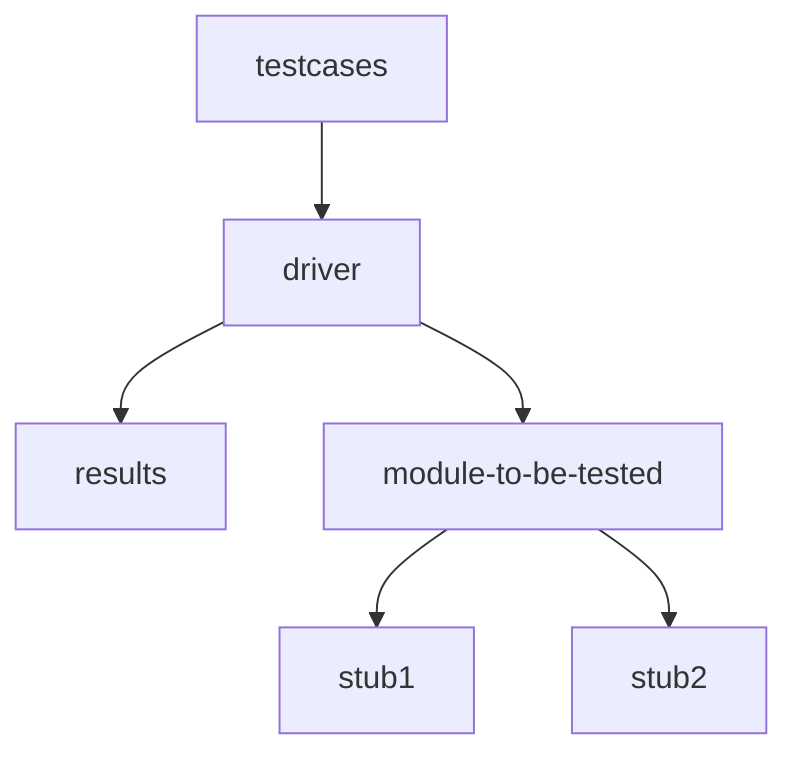

# Software Testing
	- What ? to find out errros in the software
	- testing begins in the small and progress to the large
	- test specification documents
	- testing also called verification and validation
	- verification - "are we building the product right?"
	- validation - "are we building the right product"
	- Two team
		- software developers
		- independent software testing teams
	- Four steps of testing
		- unit testing
		- integration testing
		- validation testing

## Unit Testing
	1) Interface - test data flow across the components
	2) Local Data Structures - analysis of local data structure and impact on global variables
	3) Boudary Conditions - test the boudary conditions
	4) Independent paths - identify erroneour computations, inccorect control flow or incorrect comparisons
	5) Error handling paths - to test the error handling paths

	- Stub - invoked by the component to be tested
	- Drivers - "main program" that accepts the test case data and invoked the component to be tested.
## Integration Testing
	- Interfacing is the need for this
	- systematic technique for constructing the software architecture while at the same time conducting tests to uncover the errors associated with interfacing.
	- Two approches
		- Big Band approach
		- Incremental approach	
			- Bottom Up approach 
			- top down approach
### Top Down Approach
	- either a depth first or breadth first manner
	- Main control module is treated as a test driver and subordinates are replaced with a stub
	- subordinates stubs are replaced with actual components over time.
	- test is completed
	- another stub is replaced
	- regression testing (involves rerunning tests after a certain change has been made to the program)
#### Limitations
	- stubs are used inplace of subordinates of main module
		- SOLUTIONS
		- delay tests until stubs are replaced with actual modules
		- develop stubs that perform limited functions
		- start integration from bottom up
### Bottom Up Approach
	- need for stubs are eliminated
	- low level components are clubbed together into clusters
	- a driver is written to coordinates test case input and output 
	- a cluster is tested. 
	- drivers are removed and clusters are removed moving upward

# Testing
## Regression Testing
	- Re-execution of a subset of tests to ensure that changes have not propagated any unintented side effects.
	- Includes 3 categories of tests
		- a general set of tests that checks all the general functionality of the tests
		- additional tests that focus on the software functions that could be affected by the changes
		- tests that focus on the software component that was changed.
## Smoke Testing
	- A build includes all the data files, libraries, reusable modules and engineered components that are required to implement one or more product functions
	- tests are designed to expose hidden errors that will keep the build from properly doing its functions
	- the build is integrated with other builds and smoke tested everyday.
## Validation testing
	- Configuration review
		- to ensure that all elements of the software configuration have been properly developed, are cataloged and have the necessary details
	- Alpha testing
		- the alpha test is carried out at the deveopers suite with a representative group of end users.
	- Beta testign
		- conducted at one or more end user sites
	- acceptance testing 
		- customer perfoms a series of specific tests
## System testing
	1) recovery testing
	2) security testing
	3) stress testing
	4) perfomance testing
	5) deployment testing

### Debugging process
	When a test case uncovers an error, it is debugged
	Debuggin has 2 outcomes
		1) the cause will be found and corrected
		2) the cause will not be found

### Debugging strategies
	1) brute force : Print debuggin, going through memory-dumps, log files stack-traces to find clues
	2) back tracking : back tracks through the execution path to find out why the error occured
	3) cause elimination : hypothesis for why the error occured is construccted and either the code is directly changed or test cases are written to test whether the hypothesis is correct
	4) automated debugging : tools are used
	5) bisect : previous versions of the software are examined until a version with no error is found

## Software Test Case design
	